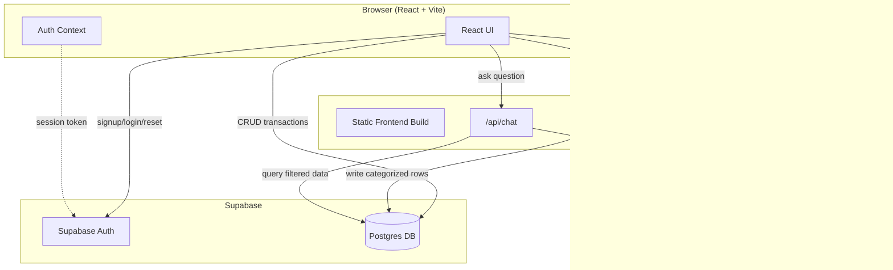
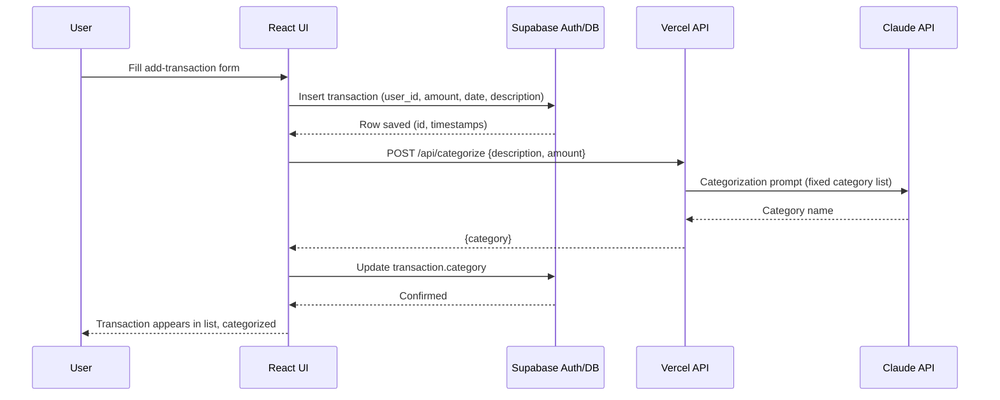
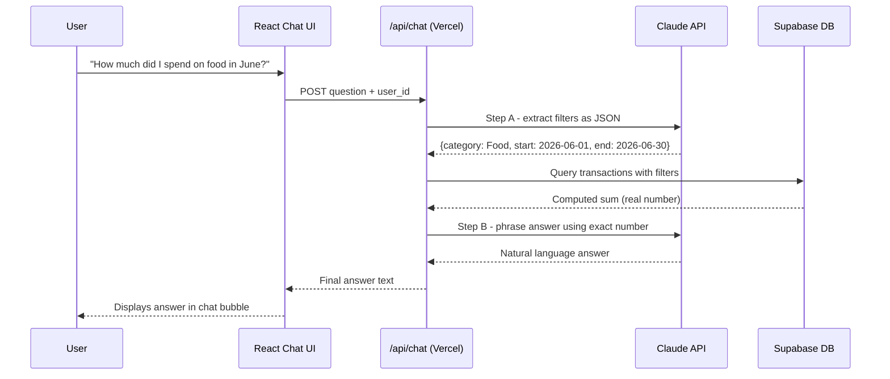

# Architecture — AI-Powered Personal Finance Analyzer
### Day 2 Deliverable | AB Talks 60-Day Claude AI Challenge Capstone

> Source of truth for tech stack and system architecture. Do not change these decisions during implementation unless a critical issue is discovered — flag and get approval first.

---

## 1. Finalized Tech Stack

| Layer | Choice | Why |
|---|---|---|
| **Frontend** | React (Vite) | Fast dev server, minimal config, industry-standard, good fit for intermediate skill level. Vite is much faster than Create React App. |
| **Backend / API** | Vercel Serverless Functions (Node.js) | No separate server to manage or deploy — API routes live inside the same project and deploy automatically with the frontend. Keeps setup simple for a 1–2 hr/day time budget. |
| **Database** | Supabase (Postgres) | Free tier, real relational database (good fit for structured transaction data), built-in Row-Level Security for per-user data isolation, clean dashboard for inspecting data. |
| **Authentication** | Supabase Auth | Bundled with Supabase — email/password signup, login, and forgot-password work out of the box with a few SDK calls. No separate service to configure. |
| **AI Model/API** | Anthropic Claude API | Required by the PRD; called server-side only via Vercel functions so the API key is never exposed to the browser. Powers categorization, insights, and chat. |
| **Charts** | Recharts | Simple, responsive React charting library — covers the PRD's pie chart + trend chart requirement with minimal code. |
| **CSV Parsing** | PapaParse | Robust, well-tested client-side CSV parser — handles quoted fields and validation errors cleanly. |
| **Hosting** | Vercel (free tier) | Deploys React + serverless functions together with zero config, connects directly to GitHub, auto-redeploys on push. |
| **Routing** | React Router | Standard, lightweight routing for the small number of pages needed (Login, Signup, Dashboard, Chat, etc.). |

**Note vs. Day 1 Blueprint:** the original blueprint listed "Node.js/Express OR serverless functions" as an either/or. This is now locked to **Vercel Serverless Functions** specifically — avoids running/deploying a second backend service since Vercel already hosts the frontend. No conflict with the PRD; this only removes an unnecessary decision point.

---

## 2. System Architecture

### 2.1 Component Diagram

### 2.2 Request Lifecycle — Example: Adding a Manual Transaction

### 2.3 AI Interaction Pattern — Chat Feature (Grounded Q&A)

**Design principle behind the chat pattern:** Claude never performs the actual math. It only (a) extracts structured filters from the question, and (b) phrases the final answer using a number computed by our own backend code. This guarantees factual accuracy — no hallucinated figures — matching the PRD requirement that chat answers must be grounded in real data.

### 2.4 External Services

| Service | Purpose |
|---|---|
| Supabase | Authentication (signup/login/reset) + Postgres database with Row-Level Security |
| Anthropic Claude API | Categorization, insight generation, chat Q&A — always called server-side |
| Vercel | Hosting for frontend build + serverless API functions, auto-deploys from GitHub |
| GitHub | Source control, single source of truth for all code, connected to Vercel for CI/CD |

### 2.5 Data Flow Summary

1. All user-facing pages are static React, built once and served from Vercel's CDN.
2. All database reads/writes for transactions go directly from the browser to Supabase (using the Supabase client SDK with RLS enforcing per-user isolation) — no need for a backend hop for basic CRUD.
3. Anything requiring the Claude API goes through a Vercel serverless function — this is the **only** path that ever touches the Anthropic API key, which lives in Vercel's environment variables, never in frontend code.
4. Auth state is tracked client-side via Supabase Auth's session/token mechanism, exposed to the app through a React Context.
