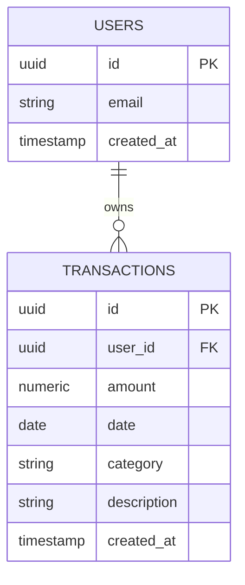

# Database Design — AI-Powered Personal Finance Analyzer
### Day 2 Deliverable | AB Talks 60-Day Claude AI Challenge Capstone

> Source of truth for the database schema. Only one table is needed for v1.0 — this is intentional, per PRD scope.

---

## 1. Entity Relationship Diagram



`USERS` is Supabase's built-in `auth.users` table — we do not create or manage this table ourselves. Supabase Auth handles it entirely (signup, login, password reset).

---

## 2. Table: `transactions`

| Field | Type | Constraints | Notes |
|---|---|---|---|
| `id` | uuid | Primary Key, default `gen_random_uuid()` | |
| `user_id` | uuid | Foreign Key → `auth.users.id`, NOT NULL | Links every transaction to its owner |
| `amount` | numeric(12,2) | NOT NULL | Positive = expense. No income/expense sign convention for v1.0 — kept simple. |
| `date` | date | NOT NULL | Stored in ISO format (`YYYY-MM-DD`) to avoid timezone bugs |
| `category` | text | NOT NULL, CHECK constraint against fixed list | Fixed list: Food & Dining, Groceries, Transport, Shopping, Bills & Utilities, Entertainment, Health, Income, Other |
| `description` | text | NOT NULL, max 255 chars (enforced client-side) | Free text |
| `created_at` | timestamptz | default `now()` | Used for "newest first" sorting |

### Suggested SQL (for Day 3 setup reference)

```sql
create table transactions (
  id uuid primary key default gen_random_uuid(),
  user_id uuid not null references auth.users(id) on delete cascade,
  amount numeric(12,2) not null,
  date date not null,
  category text not null check (category in (
    'Food & Dining', 'Groceries', 'Transport', 'Shopping',
    'Bills & Utilities', 'Entertainment', 'Health', 'Income', 'Other'
  )),
  description text not null,
  created_at timestamptz default now()
);

alter table transactions enable row level security;

create policy "Users can manage their own transactions"
  on transactions
  for all
  using (auth.uid() = user_id)
  with check (auth.uid() = user_id);
```

---

## 3. Row-Level Security (RLS)

Policy: `auth.uid() = user_id`, applied to SELECT, INSERT, UPDATE, and DELETE.

This guarantees data isolation is enforced **at the database level**, not just in application code — even if a bug in the frontend tried to query another user's data, Postgres itself would block it.

---

## 4. Validation Against Every PRD User Story

| PRD Requirement | Covered by schema? | How |
|---|---|---|
| FR-1: Auth (signup/login/reset) | ✅ | Handled entirely by Supabase's `auth.users` — no custom table needed |
| FR-2: Manual entry (Amount, Date, Category, Description) | ✅ | All 4 fields present as columns |
| FR-3: CSV import (Date, Amount, Description) | ✅ | Same table; `category` populated by AI after parsing |
| FR-4: AI categorization + user override | ✅ | `category` is a normal, editable text column with a CHECK constraint |
| FR-5: Dashboard charts (category breakdown + trend) | ✅ | `category` supports pie chart grouping; `date` supports trend grouping |
| FR-6: On-demand AI insights | ✅ | Computed directly from this table at request time — no extra storage needed |
| FR-7: Chat Q&A grounded in data | ✅ | `/api/chat` queries this table with extracted filters (category/date range) |
| FR-8: Edit/delete transactions | ✅ | Standard UPDATE/DELETE, protected by RLS |
| Multi-user data isolation | ✅ | Enforced via `user_id` foreign key + Row-Level Security policy |

**Conclusion:** One clean `transactions` table is sufficient for all v1.0 requirements. No additional tables are needed. Future Scope items (budgets, goals, multi-currency) would require new tables later, but are intentionally excluded from this schema to stay within the project's time budget.
