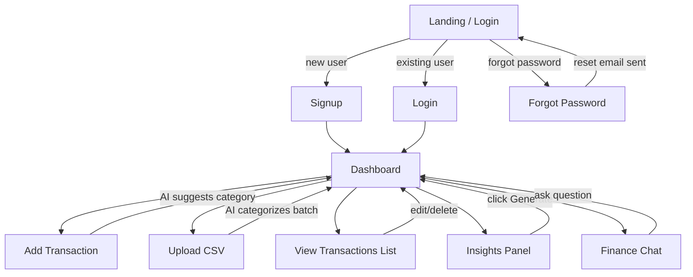
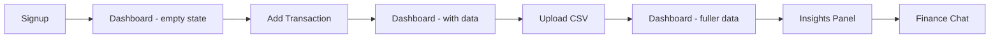

# UI & User Flow — AI-Powered Personal Finance Analyzer
### Day 2 Deliverable | AB Talks 60-Day Claude AI Challenge Capstone

> Low-fidelity wireframes and navigation structure. Every screen maps to a specific PRD requirement — no extra screens.

---

## 1. User Flow Diagram



## 2. Screen Flow — New User Happy Path



## 3. Screen Inventory — Every Screen's Reason to Exist

| Screen | PRD Requirement | Purpose |
|---|---|---|
| Signup | FR-1 | New account creation |
| Login | FR-1 | Returning user access |
| Forgot Password | FR-1 | Password recovery via email |
| Dashboard | FR-5, FR-6 | Central hub: summary cards, charts, insights entry point |
| Add Transaction (form) | FR-2 | Manual expense entry |
| CSV Upload | FR-3 | Bulk import from bank statement export |
| Transaction List | FR-8 | View, edit, delete individual transactions |
| Finance Chat | FR-7 | Ask direct questions about own spending data |

No screens exist outside this list. This is intentional — matches PRD scope exactly.

---

## 4. Navigation Structure

```
Navbar (visible when logged in)
├── Logo / App Name
├── Dashboard (home)
├── Transactions
├── Chat
└── Logout

Dashboard page contains:
├── Summary Cards (total spent, top category, # transactions)
├── Category Pie Chart
├── Spending Trend Chart
├── "Add Transaction" button → opens Add Transaction form
├── "Upload CSV" button → navigates to CSV Upload screen
└── "Generate Insights" button → Insights Panel
```

Single-level navigation — no nested menus. Everything is reachable in one click from the navbar or dashboard, appropriate for an app this size.

---

## 5. Low-Fidelity Wireframes

### 5.1 Login Screen
```
┌─────────────────────────────────────┐
│                                       │
│         💰 Finance Analyzer          │
│                                       │
│   ┌─────────────────────────────┐   │
│   │ Email                        │   │
│   └─────────────────────────────┘   │
│   ┌─────────────────────────────┐   │
│   │ Password                     │   │
│   └─────────────────────────────┘   │
│                                       │
│          [   Log In   ]              │
│                                       │
│   Forgot password?     Sign up       │
│                                       │
└─────────────────────────────────────┘
```

### 5.2 Signup Screen
```
┌─────────────────────────────────────┐
│         💰 Finance Analyzer          │
│                                       │
│   ┌─────────────────────────────┐   │
│   │ Email                        │   │
│   └─────────────────────────────┘   │
│   ┌─────────────────────────────┐   │
│   │ Password                     │   │
│   └─────────────────────────────┘   │
│                                       │
│          [   Sign Up   ]             │
│                                       │
│   Already have an account? Log in    │
└─────────────────────────────────────┘
```

### 5.3 Forgot Password Screen
```
┌─────────────────────────────────────┐
│         💰 Finance Analyzer          │
│                                       │
│   Enter your email to reset          │
│   your password:                     │
│                                       │
│   ┌─────────────────────────────┐   │
│   │ Email                        │   │
│   └─────────────────────────────┘   │
│                                       │
│        [  Send Reset Link  ]         │
│                                       │
│   ← Back to Login                    │
└─────────────────────────────────────┘
```

### 5.4 Dashboard (Empty State — New User)
```
┌───────────────────────────────────────────────────┐
│ 💰 Finance Analyzer   Dashboard  Transactions  Chat │  Logout │
├───────────────────────────────────────────────────┤
│                                                       │
│         You haven't added any transactions yet      │
│                                                       │
│      [ + Add Transaction ]   [ ⬆ Upload CSV ]       │
│                                                       │
└───────────────────────────────────────────────────┘
```

### 5.5 Dashboard (With Data)
```
┌───────────────────────────────────────────────────┐
│ 💰 Finance Analyzer   Dashboard  Transactions  Chat │  Logout │
├───────────────────────────────────────────────────┤
│  ┌───────────┐ ┌───────────┐ ┌───────────┐         │
│  │ Total      │ │ Top        │ │ # Trans-  │         │
│  │ $1,204.50  │ │ Category   │ │ actions   │         │
│  │ this month │ │ Bills      │ │ 42        │         │
│  └───────────┘ └───────────┘ └───────────┘         │
│                                                       │
│  ┌─────────────────────┐  ┌─────────────────────┐  │
│  │   [ Pie Chart ]       │  │  [ Trend Chart ]     │  │
│  │   Spending by         │  │  Spending over       │  │
│  │   Category             │  │  Time                 │  │
│  └─────────────────────┘  └─────────────────────┘  │
│                                                       │
│  [ + Add Transaction ]  [ ⬆ Upload CSV ]            │
│  [ ✨ Generate Insights ]                            │
│                                                       │
│  ┌───────────────────────────────────────────┐     │
│  │ 💡 "You spent 22% more on Bills this        │     │
│  │     month, mostly due to a utilities        │     │
│  │     increase."                              │     │
│  └───────────────────────────────────────────┘     │
└───────────────────────────────────────────────────┘
```

### 5.6 Add Transaction Form (modal)
```
┌───────────────────────────────────┐
│  Add Transaction               ✕  │
├───────────────────────────────────┤
│  Amount:      [___________]       │
│  Date:        [___________]       │
│  Category:    [ Suggested ▾ ]     │  ← AI-suggested, editable
│  Description: [___________]       │
│                                     │
│         [ Cancel ]  [ Save ]      │
└───────────────────────────────────┘
```

### 5.7 CSV Upload Screen
```
┌───────────────────────────────────────────────────┐
│ 💰 Finance Analyzer   Dashboard  Transactions  Chat │  Logout │
├───────────────────────────────────────────────────┤
│  Upload Bank Statement (CSV)                        │
│                                                       │
│  Required columns: Date, Amount, Description         │
│  [ Download Template ]                               │
│                                                       │
│  ┌─────────────────────────────────────────────┐   │
│  │        Drag & drop CSV file here              │   │
│  │             or click to browse                │   │
│  └─────────────────────────────────────────────┘   │
│                                                       │
│  Preview (after upload):                             │
│  ┌─────────────────────────────────────────────┐   │
│  │ Date       Amount   Description   Category    │   │
│  │ 2026-06-01  45.00   Groceries      Groceries   │   │
│  │ 2026-06-02  12.50   Coffee shop    Food & ...  │   │
│  └─────────────────────────────────────────────┘   │
│                                                       │
│              [ Confirm & Import ]                    │
└───────────────────────────────────────────────────┘
```

### 5.8 Transaction List Screen
```
┌───────────────────────────────────────────────────┐
│ 💰 Finance Analyzer   Dashboard  Transactions  Chat │  Logout │
├───────────────────────────────────────────────────┤
│  All Transactions                [ + Add ]          │
│                                                       │
│  ┌─────────────────────────────────────────────┐   │
│  │ Date       Category    Description   Amount   │   │
│  │ 2026-06-02 Food        Coffee shop   $12.50 ✎🗑│   │
│  │ 2026-06-01 Groceries   Weekly shop   $45.00 ✎🗑│   │
│  │ ...                                             │   │
│  └─────────────────────────────────────────────┘   │
└───────────────────────────────────────────────────┘
```

### 5.9 Finance Chat Screen
```
┌───────────────────────────────────────────────────┐
│ 💰 Finance Analyzer   Dashboard  Transactions  Chat │  Logout │
├───────────────────────────────────────────────────┤
│  Ask about your spending                             │
│                                                       │
│  [How much on food?] [Biggest category?] [This month]│  ← suggested chips
│                                                       │
│  ┌─────────────────────────────────────────────┐   │
│  │  You: How much did I spend on food in June?   │   │
│  │                                                 │   │
│  │  Bot: You spent $312.40 on Food & Dining       │   │
│  │       in June.                                 │   │
│  └─────────────────────────────────────────────┘   │
│                                                       │
│  ┌─────────────────────────────────────────────┐   │
│  │ Type a question...                    [Send]  │   │
│  └─────────────────────────────────────────────┘   │
└───────────────────────────────────────────────────┘
```

---

## 6. Design Notes for Implementation

- Keep all forms simple: label above input, generous spacing, single-column layout (mobile-first).
- Loading states required on: Add Transaction save, CSV import, Generate Insights, Chat send — all involve an AI call and must never feel frozen.
- Empty states required on: Dashboard (no transactions yet), Transaction List (no transactions yet).
- Error states required on: failed login, failed signup (duplicate email), failed CSV validation, failed AI call (any of the 3 endpoints).
- Charts and summary cards must gracefully handle zero/near-zero data without breaking layout.
